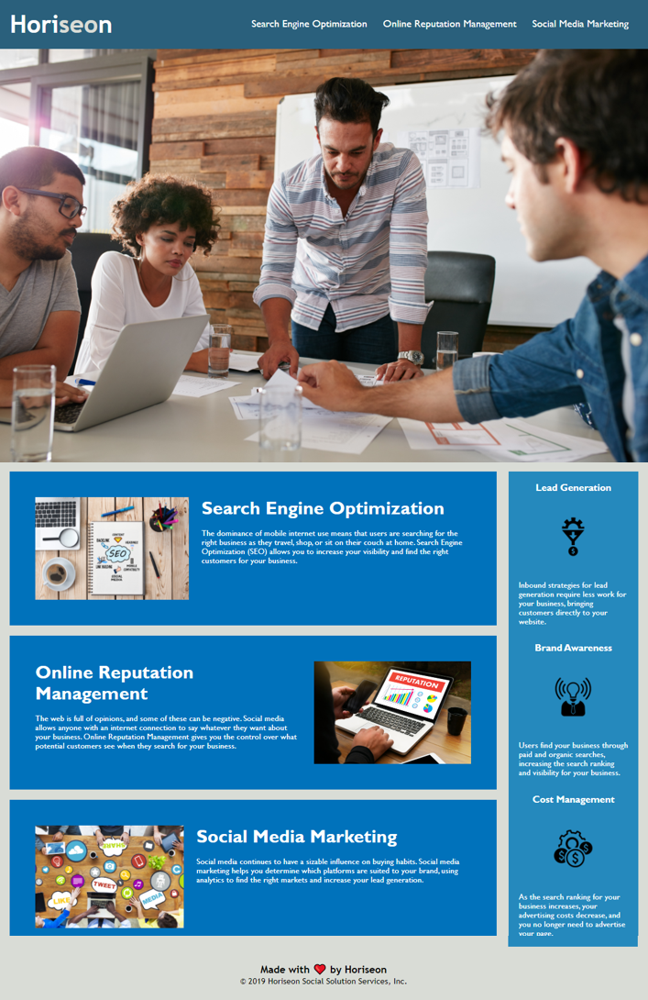

# HW-01-Code-Refactor

## This Repository 

In this project, I was tasked with an on-the-job ticket from a marketing agency. I took already written code and modified it to correct syntax and add accessiblity. Accessiblity is important to add to make sure everyone coming to the site can access the information given. By adding in proper syntax, alt tags, tab-index, and color checks, I hope to address issues people may have reading the website. 

Through this project, I learned how to check for basic accessiblity needs, correct tags to make them semantic, and how to use css to not only help with aesthetics, but also think about everyone and their needs when they land on websites. What makes my project stand out is by adding a skip to main content button to allow users to skip navigation and get to the important information. 

### Changes Made to Code
* moved stylesheet link to bottom of head tag
* modified div tags to header, nav, section, aside, and footer 
* added id to search-engine-optimization so that it would link properly from the nav
* changed class of main sections to match to consolidate css 
* deleted repetitive css and consilidated to one code per tag under new content-info tag
* added alt tags to all images
* deleted img closing tags that had been applied
* added skip to main content that is tabindex 1 for accessibility to allow users to skip nav and go straight to content

### Important Link and Screenshot

* [deployed site](https://breyera.github.io/HW-01-Code-Refactor/)

